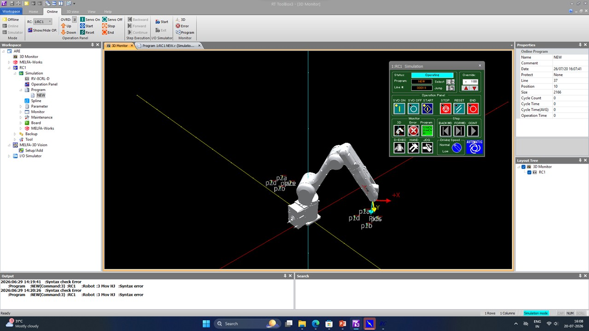
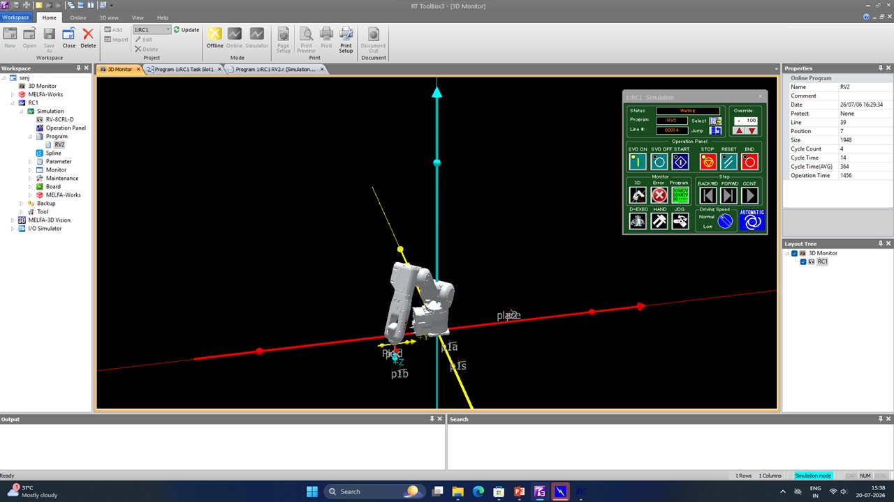
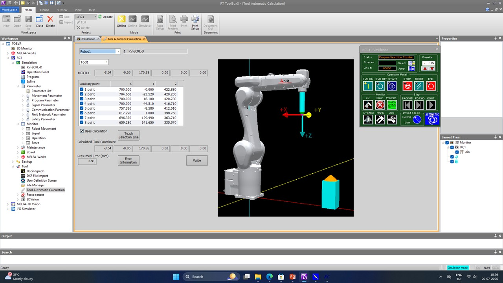
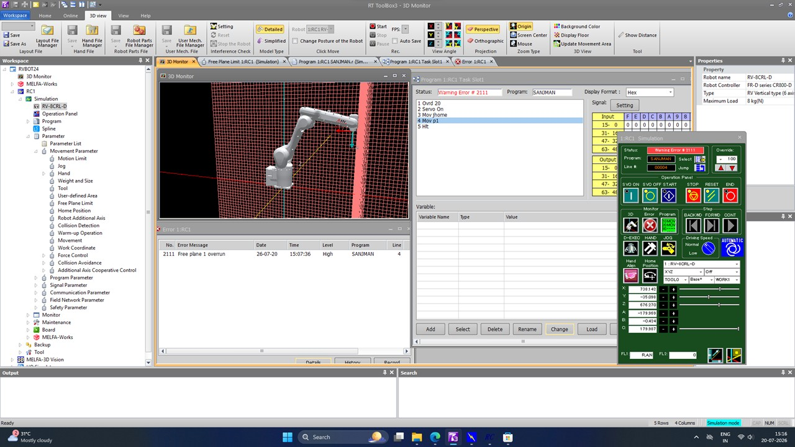

# RTtoolbox3 - Mitsubishi 6-Axis Cobot Tutorial

Simulation exercises for controlling a Mitsubishi 6-axis collaborative robot using RTToolBox3.

---

## Repository Contents

| File | Description |
|------|-------------|
| `exercise1_paletatopaletb.zip` | Move an object from Palette A to Palette B |
| `exercise2_palettostacking.zip` | Stack four objects on a pallet |
| `exercise3_toolautomaticcal....zip` | Automatic Tool Calibration |
| `exercise4_creatingfence.zip` | Creating a Safety Fence in the Workspace |

---

# Exercise 1 - Palette to Palette

**Objective**

Move an object from Palette A to Palette B using RTToolBox3.

### Result

<p align="center">

</p>

---

# Exercise 2 - Pallet Stacking

**Objective**

Pick and stack four objects sequentially.

### Result

<p align="center">

</p>

---

# Exercise 3 - Automatic Tool Calibration

**Objective**

Perform automatic tool frame calibration for the robot.

### Result

<p align="center">

</p>

---

# Exercise 4 - Creating a Safety Fence

**Objective**

Create a safety fence around the robot workspace.

### Result

<p align="center">

</p>

---

# Software Used

- Mitsubishi RTToolBox3
- Mitsubishi 6-Axis Collaborative Robot
- Windows 10 / 11

---

# Skills Learned

- Robot Programming
- Pick and Place Operations
- Palletizing
- Tool Frame Calibration
- Safety Fence Configuration
- Workspace Management

---

# Repository Structure

```
.
├── README.md
├── ex1.jpg
├── ex2result.jpg
├── ex3result.jpg
├── ex4result.jpg
├── exercise1_paletatopaletb.zip
├── exercise2_palettostacking.zip
├── exercise3_toolautomaticcal....zip
└── exercise4_creatingfence.zip
```

---

## Author

Developed as part of learning and simulation exercises for the Mitsubishi 6-Axis Collaborative Robot using RTToolBox3.
